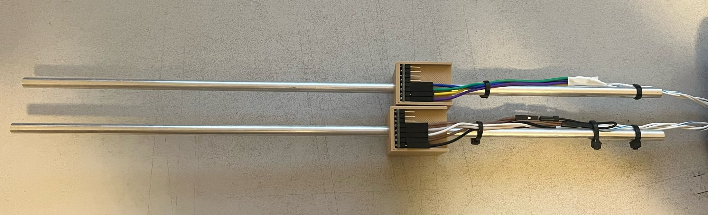
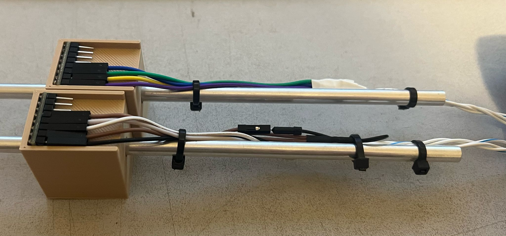
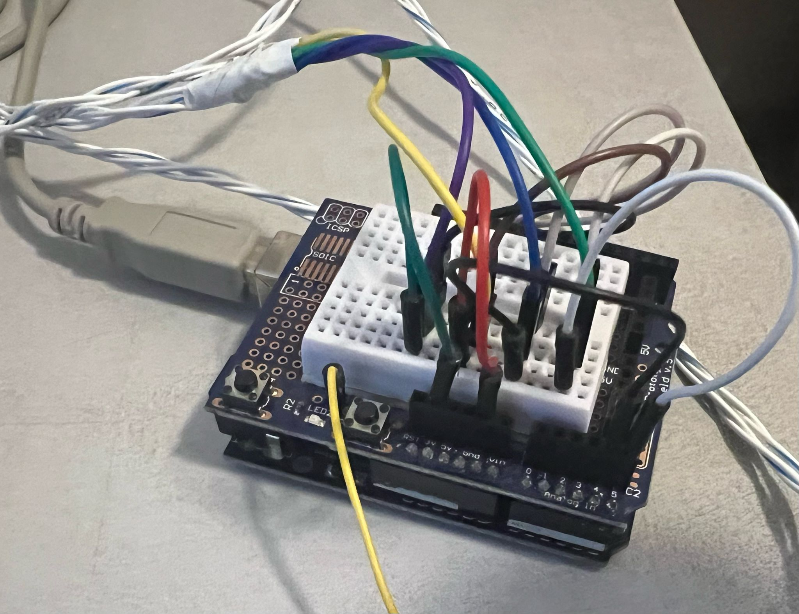
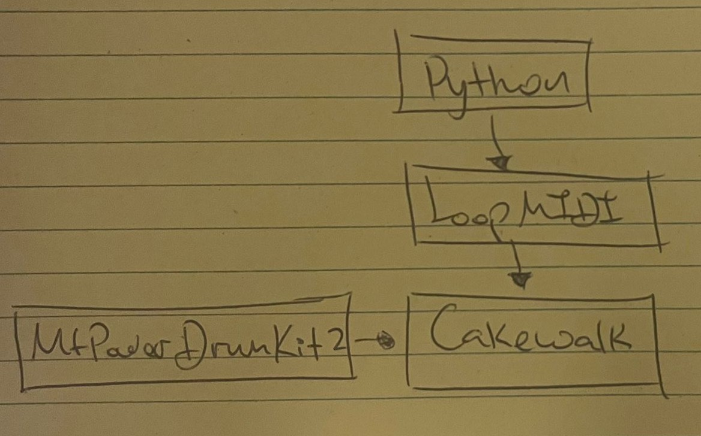

# IMU_AirDrums

## Introduction
Using two BNO055 IMUs and an Arduino Uno to create air drums.
Each IMU provides absolute orientation data, which is sent to a Python script for processing.
After an initial calibration step, the 3D space is divided into five distinct zones: three lower (downward) strike zones and two upper strike zones.
When a movement is detected within one of these zones, it is interpreted as a drum hit.

## Setup
Each drum stick has a BN055 IMU 

  
   

note that the IMU allows 2 addresses 0x28 and 0x29 by shortning a pin so thats how they can sit on the same protocol.

And this is the Uno: 

  

Does it help? probably not ... but theres nothing special I2C on both sensors and electricty to them.

Finally on the PC side i wanted real drums so ive used an emulator called cakewalk with a drums plugin.
To connect to cakewalk ive used loopMIDI and sent the MIDI signal via python (this is the delay i can play with). 

  

## To Do
- Hit Volume control using the accleration value.
- Work more on the delay reduction.

## Demonstration video
A small video of the system working
<video src="https://github.com/mmax1406/ESPNowQuadReciver/assets/83958573/7fff8d3d-69e9-45aa-8dc3-a3fcc9aecb53" style="width: auto; height: auto;"></video>

